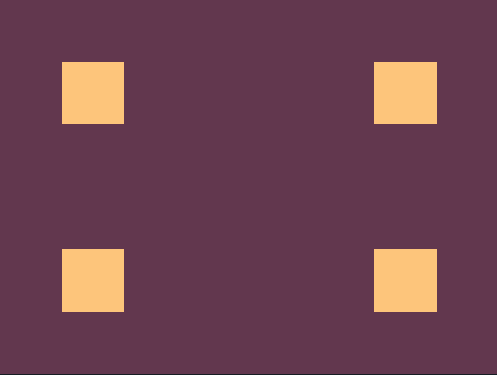

<h3>CSS Battle Solutions</h3>

#### This repository contains solutions to the challenges on [cssbattle.dev](https://cssbattle.dev)

#### The following solutions might not fetch you the best score in terms of number of characters used (as I try to format my code properly rather than trying to remove the white spaces to reduce the character count) but all of them will definitely result in a 100% match

| Challenge      | Screenshot  | Solution |
| ----------- | ----------- | -------- |
| [1.Simply Square](https://cssbattle.dev/play/1) |  | [Solution](https://github.com/umang-sinha/css-battles/blob/main/001.simply-square.css) |
| [2.Carrom](https://cssbattle.dev/play/2) |  | [Solution](https://github.com/umang-sinha/css-battles/blob/main/002.carrom.css) |
